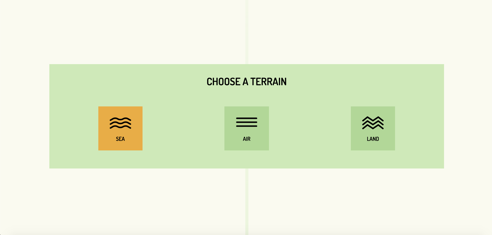
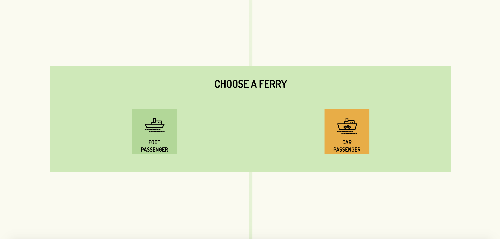
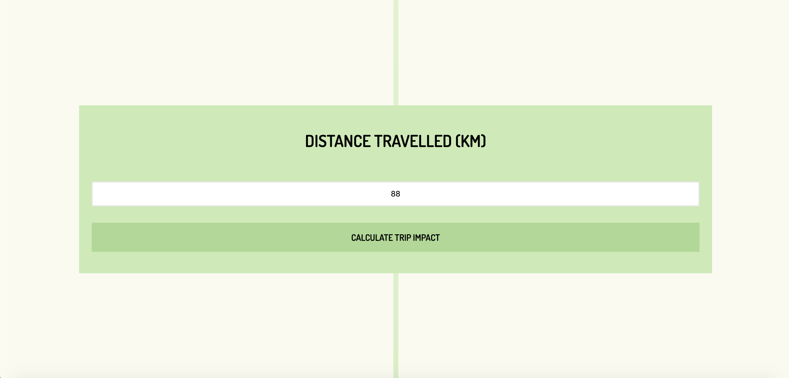
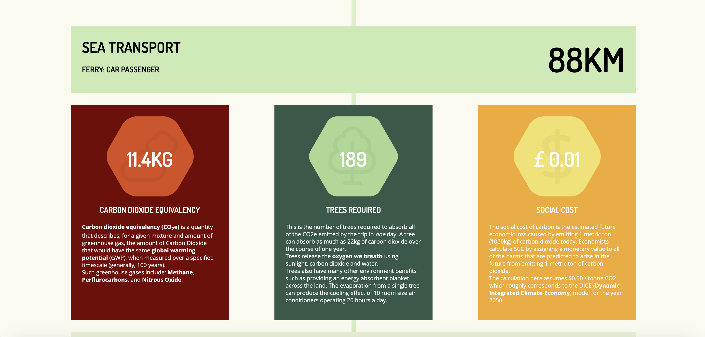
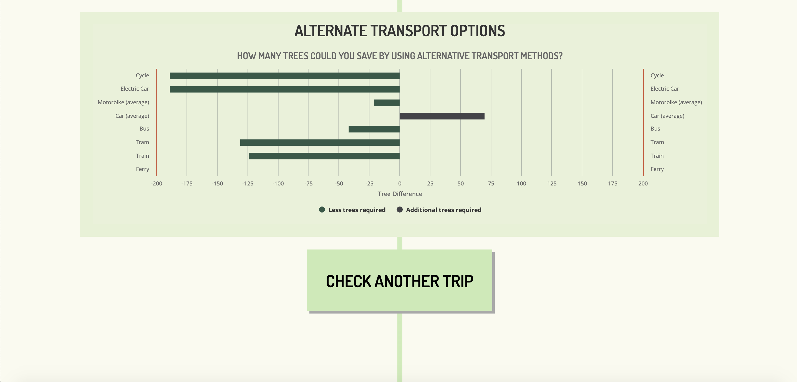

# CodeClan Week 9 Group Project
Alasdair Carstairs, Eric Cross, Myriam Boran

TreeTrip Javascript Project








Install dependencies:

```
npm install
```

Run a mongoDB server:

```
mongod
```

Seed the database:

```
mongo < server/db/seeds.js
```

Run webpack:

```
npm run build
```

Run express:

```
npm run server:dev
```

### Using

The application is running on port 300 so visit http://localhost:3000.
